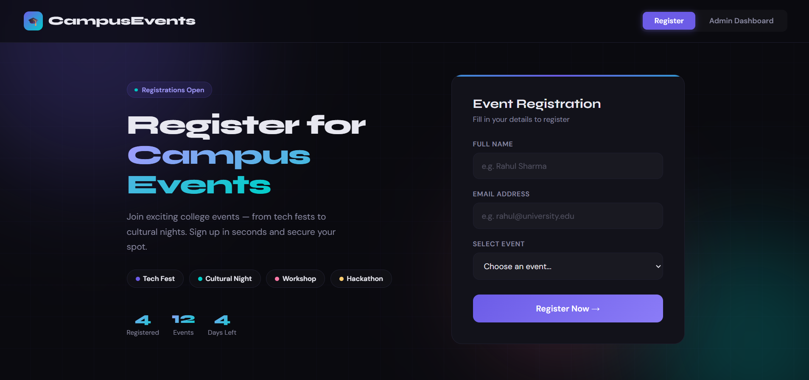
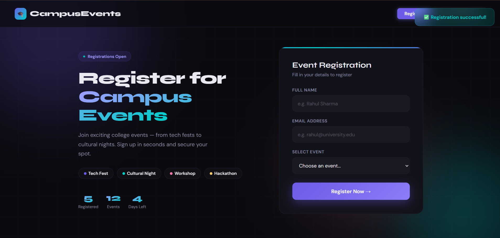
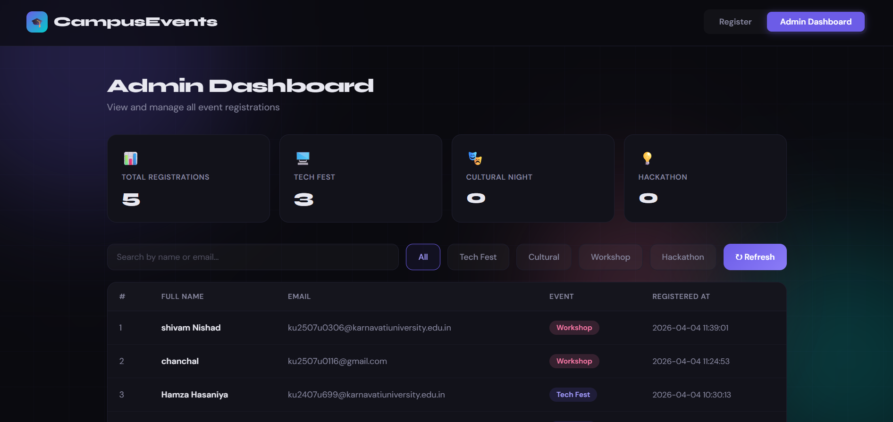

# 🎓 Campus Event Registration System

## 📌 Project Description
This is a web-based event registration system built using **Flask** and **MySQL**.  
Users can register for different college events, while duplicate registrations are prevented.  
An admin dashboard allows viewing, searching, and managing all registrations.

---

## 🚀 Features
- Event registration form  
- Duplicate email prevention (per event)  
- Admin dashboard to view registrations  
- Search and filter functionality  
- Real-time registration count  
- Clean and responsive UI  

---

## 🛠️ Technologies Used
- **Frontend:** HTML, CSS, JavaScript  
- **Backend:** Python (Flask)  
- **Database:** MySQL  

---

## 🖥️ Frontend (UI)

### 🔹 Overview
- Built using HTML, CSS, JavaScript  
- User-friendly and responsive interface  

### 🔹 Features
- Registration form (Name, Email, Event)  
- Uses `fetch()` API for backend communication  
- Displays success/error messages  
- Admin dashboard UI  
- Search and filter support  

### 🔹 Flow
1. User fills the form  
2. Clicks **Register**  
3. Data sent via `fetch()` API  
4. Response displayed to user  

---

## ⚙️ Backend (Flask API)

### 🔹 Overview
- Built using Flask (Python)  
- Handles logic, validation, and database operations  

### 🔹 Features
- REST API endpoints  
- MySQL database integration  
- Duplicate registration prevention  
- JSON responses  

### 🔹 API Endpoints
- `POST /register` → Register user  
- `GET /api/registrations` → Fetch all registrations  

### 🔹 Flow
1. Receive request from frontend  
2. Validate input  
3. Check duplicate email  
4. Store data in MySQL  
5. Send response  

---

## 🔗 Frontend ↔ Backend Flow
- Frontend sends requests using `fetch()`  
- Backend processes via Flask routes  
- Data stored in MySQL  
- Response returned to frontend  

---

## 🛠️ Tech Stack

### Frontend
- HTML  
- CSS  
- JavaScript  

### Backend
- Python (Flask)  
- Flask-CORS  

### Database
- MySQL (Railway)

### Hosting
- Render  

---

## ⚙️ Installation & Setup

### 1️⃣ Install Dependencies
```bash
pip install flask flask-cors mysql-connector-python
```

### 2️⃣ Setup MySQL Database
```sql
CREATE DATABASE college_events;

USE college_events;

CREATE TABLE registrations (
    id INT AUTO_INCREMENT PRIMARY KEY,
    full_name VARCHAR(100),
    email VARCHAR(100),
    event_name VARCHAR(100),
    registered_at TIMESTAMP DEFAULT CURRENT_TIMESTAMP
);
```

### 3️⃣ Configure Database (app.py)
```python
'password': 'your_password_here'
```

---

## ▶️ Run the Project

```bash
python app.py
```

Open in browser:
```
http://127.0.0.1:5000
```

---

## 🌐 Live Demo
👉 https://college-event-system-evfm.onrender.com/

---

## ☁️ Google Cloud Integration (Concept)

### 🔹 Backend Hosting
- Deploy Flask app using **Cloud Run**  
- Enables public access  

### 🔹 Database
- Use **Cloud SQL (MySQL)**  
- Secure and managed database  

### 🔹 Storage
- Use **Cloud Storage**  
- Store images, files, backups  

### 🔹 API Hosting
- APIs run via **Cloud Run**  

### 🔹 Access
- Globally accessible via URL  

---

## 📸 Screenshots
| Feature | Preview |
|--------|--------|
| Registration Form |  |
| Success Message |  |
| Admin Dashboard |  |

---

## 🎥 Demo Video

▶️ Click below to watch:

[](https://drive.google.com/file/d/1pGBMSj3qtzhnmIr7qNftph8JPV4-ItX1/view?usp=drive_link)

---

## 🔮 Future Improvements
- User authentication system  
- Email confirmation feature  
- Full cloud deployment (Cloud Run + Cloud SQL)  
- Enhanced mobile responsiveness  

---

## ✅ Conclusion
This project demonstrates full-stack development using **Flask + MySQL** with frontend-backend integration.  
It also introduces **cloud scalability concepts using Google Cloud services**.